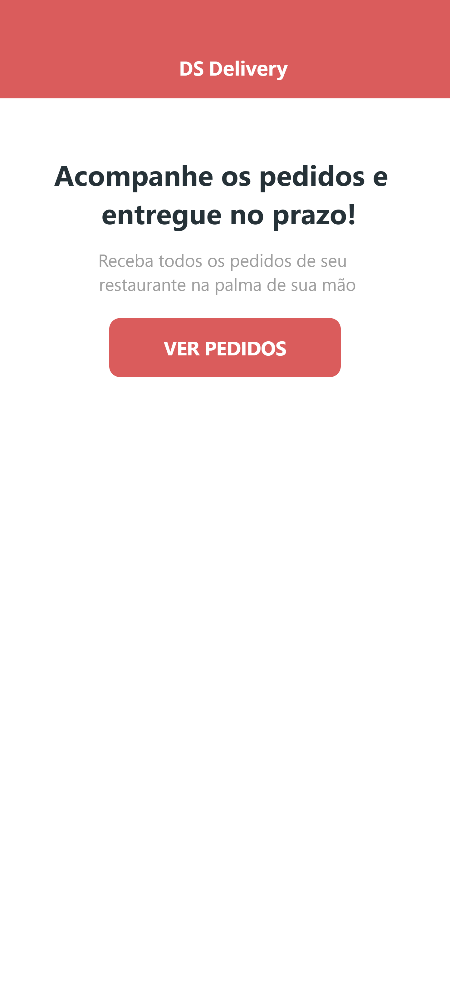
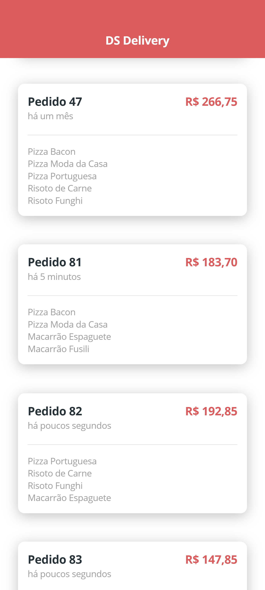
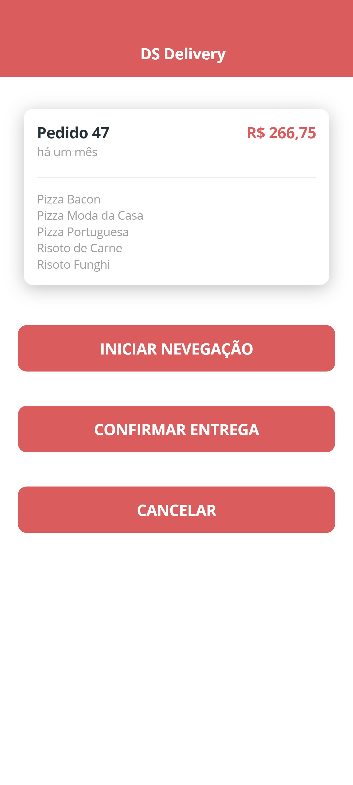
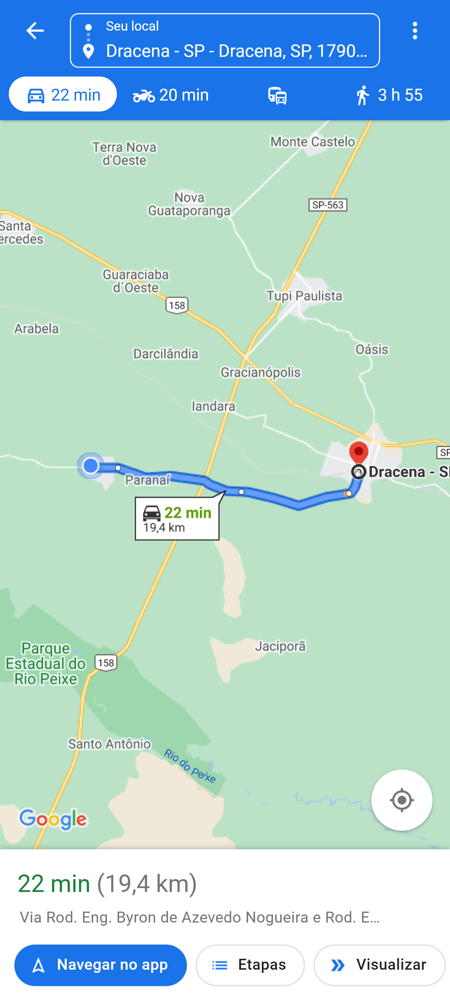

# DS Delivery
### (Aplicação de registro e entrega de pedidos)

O projeto consiste em um sistema de registro e entrega de pedidos. Onde desenvolvemos uma aplicação WEB para realização dos pedidos e um apliacativo movel para acompanhamento dos entrgadores. 
- Foram utilizadas as seguintes tecnologias:
    - Back-end: Java Spring Boot
    - Front-end: ReactJS
    - Aplicativo móvel: React Native

- link da aplicação publicada: https://juliohensds2.netlify.app/

- OBS. os dados (os produtos) podem demorar alguns segundos para carregar, visto que a hospedagem do backend é um plano gratuito que hiberna depois de 30 min sem requisição...  

<ul>
 <li>
<b>Aplicativo móvel (React Native)</b>
</li> 

 
 
 
 
